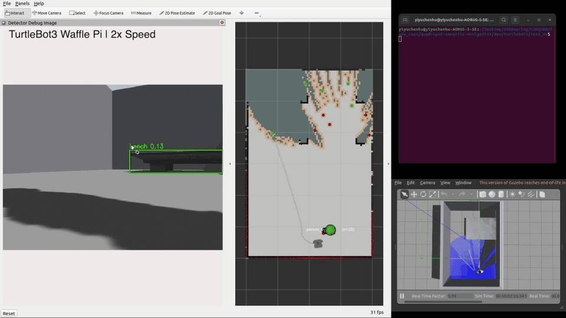
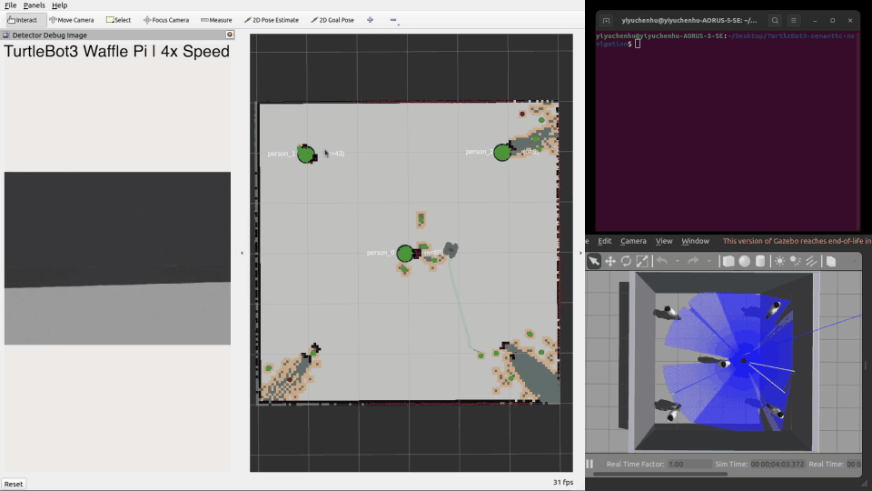

# TurtleBot3 Semantic Navigation (ROS 2)

Standalone extraction of the TurtleBot3 semantic navigation stack: YOLOv8n object detection,
camera–LiDAR object localization, persistent semantic landmarks on a SLAM map, and Nav2 goal
execution driven by simple rule-based text commands (e.g. `go to person`, `go to bench`).

**Stack:** Ubuntu 22.04 · ROS 2 Humble · Gazebo Classic · TurtleBot3 `waffle_pi` · YOLOv8n · Nav2 · SLAM Toolbox launched through `nav2_bringup` with `slam:=True`.

## Project Highlights

- **End-to-end semantic navigation pipeline on TurtleBot3 Waffle Pi**, from perception and SLAM through semantic memory to Nav2 goal execution, brought up by a single `ros2 launch` entry point.
- **YOLOv8n integrated into ROS 2** as a detector node that consumes `sensor_msgs/Image`, publishes standard `vision_msgs/Detection2DArray`, and exposes an annotated debug image for RViz.
- **Camera–LiDAR object localization** that converts each YOLO bounding-box centre into a bearing through the camera FOV and looks up a robust median range from a small `LaserScan` window to produce per-object `(x, y)` positions.
- **Semantic memory with deterministic per-class IDs** such as `person_0`, `person_1`, …, label-aware nearest-neighbour association, EMA position smoothing, and stale/remove aging, so repeated observations of the same physical object collapse into a single addressable landmark.
- **Persistent semantic landmarks on the SLAM map**, validated against the live occupancy grid (wall-island rejection, snap to obstacle-island centroid) and republished as `MarkerArray` overlays in RViz.
- **Rule-based natural-language-style terminal commands** (`go to person`, `go to person 3`, `please navigate to the bench`, …) handled deterministically with **no LLM**, supporting nearest-target and indexed selection over semantic memory.
- **Coordinator state machine** that pauses frontier exploration on a user command, dispatches the goal through Nav2's `NavigateToPose` action with cancellation and timeouts, and auto-resumes exploration when the target is reached or aborted.

## Demo Videos

### Demo 1 — Bench/Person Semantic Navigation

This demo shows TurtleBot3 Waffle Pi exploring an initially unknown 4×6 warehouse and building a SLAM map from scratch. YOLOv8n detects a table/bench target and a person; the camera–LiDAR localizer places them as semantic landmarks on the SLAM map, and a rule-based terminal command navigates the robot to the selected target through Nav2.

The full demo video is shown at 2x speed.

**Detection and semantic mapping**



**Command-based navigation**


Full demo: [Google Drive](https://drive.google.com/file/d/1D3oExylmRMmw4Q7x_d1_mcE8EcazT35I/view?usp=sharing)

---

### Demo 2 — Multi-Person Semantic Navigation with Memory Indexing

This demo shows TurtleBot3 Waffle Pi exploring an initially unknown 6×6 warehouse, building a SLAM map from scratch, detecting five identical person models with YOLOv8n, storing them as memory-indexed semantic landmarks (`person_0`, `person_1`, …), and navigating to a selected instance through a rule-based terminal command.

The full demo video is shown at 4x speed.

**Note:** Person IDs such as `person_3` are memory indices assigned by detection order, not human identity recognition.

**Multi-person semantic mapping**



**Command-based navigation**


Full demo: [Google Drive](https://drive.google.com/file/d/1Qzl15Erv7ww3lYTszrFD-1H1IQfuDk9D/view?usp=sharing)

## System Pipeline

```text
   ┌──────────────────────────────────────────────────────────┐
   │   Gazebo Classic + TurtleBot3 Waffle Pi simulation       │
   │   (custom 4×6 / 6×6 warehouse worlds)                    │
   └──────────┬─────────────────────────────────┬─────────────┘
              │ /camera/image_raw               │ /scan
              ▼                                 │
   ┌──────────────────────────┐                 │
   │  tb3_detector            │                 │
   │  YOLOv8n inference       │                 │
   │  → Detection2DArray      │                 │
   │  + ~/debug_image (RViz)  │                 │
   └──────────┬───────────────┘                 │
              │                                 │
              ▼                                 ▼
   ┌─────────────────────────────────────────────────────────┐
   │  tb3_localizer                                          │
   │  pixel → camera-FOV bearing                             │
   │  + windowed median LiDAR range → (x, y) in base_link    │
   └──────────┬──────────────────────────────────────────────┘
              │
              ▼
   ┌─────────────────────────────────────────────────────────┐
   │  tb3_memory / semantic_memory_node                      │
   │  label-aware nearest-neighbour association,             │
   │  EMA position smoothing, stale/remove aging             │
   │  → object_id = "<label>_<seq>"                          │
   └──────────┬──────────────────────────────────────────────┘
              │ ~/objects                ┌────────────────────────┐
              ├─────────────────────────►│  SLAM Toolbox          │
              │                          │  (via nav2_bringup,    │
              │                          │   slam:=True) → /map   │
              ▼                          └──────────┬─────────────┘
   ┌─────────────────────────────────────────────┐ │
   │  tb3_coordinator/semantic_map_memory_node   │◄┘  /map
   │  TF base_link→map, occupancy-grid           │
   │  validation, persistent semantic landmarks  │
   │  → MarkerArray on the SLAM map              │
   └─────────────────────────────────────────────┘

   terminal command
   "go to person 3"  /  "please navigate to the bench"
              │  /user_command
              ▼
   ┌─────────────────────────────────────────────┐
   │  tb3_coordinator (state machine)            │
   │  pauses frontier exploration, cancels any   │
   │  prior Nav2 goal, forwards the command      │
   └──────────┬──────────────────────────────────┘
              ▼
   ┌─────────────────────────────────────────────┐
   │  tb3_query (rule-based, no LLM)             │
   │  filler-word stripping, phrase aliases,     │
   │  index/nearest selection over memory        │
   │  → SemanticQueryResult                      │
   └──────────┬──────────────────────────────────┘
              ▼
   ┌─────────────────────────────────────────────┐
   │  tb3_nav_adapter                            │
   │  computes safe standoff approach pose,      │
   │  TF base_link → map → PoseStamped           │
   └──────────┬──────────────────────────────────┘
              ▼
   ┌─────────────────────────────────────────────┐
   │  Nav2 NavigateToPose action                 │
   │  global+local planner, controller,          │
   │  recoveries on the SLAM map                 │
   └──────────┬──────────────────────────────────┘
              ▼
        TurtleBot3 drives to the
        selected semantic landmark
```

The simulated TurtleBot3 streams a forward RGB image and a 360° LiDAR scan into ROS 2. `tb3_detector` runs YOLOv8n on every frame and publishes 2D detections, while `tb3_localizer` converts each bounding-box centre into a camera-frame bearing and looks up a robust median range from a small LiDAR window to obtain an `(x, y)` position in `base_link`. `tb3_memory` merges those observations into stable semantic landmarks with deterministic per-class IDs such as `person_0`, `person_1`, …, and `semantic_map_memory_node` snaps them onto the live SLAM Toolbox map for RViz overlay. A terminal command on `/user_command` is intercepted by the coordinator, parsed by the **deterministic, rule-based** `tb3_query` node (no LLM), turned into a safe approach pose by `tb3_nav_adapter`, and executed by Nav2's `NavigateToPose` action — after which the coordinator resumes frontier exploration. These IDs (e.g. `person_3`) are semantic-memory slots, not identity recognition; the system does not perform person re-identification.

## Quick build

> **Before building: download YOLOv8n weights (~6 MB).**
> The `*.pt` files are git-ignored (see `src/tb3_detector/models/.gitignore`),
> so you must fetch them locally **before `./build.sh`** — otherwise
> `detector_node` crashes on startup with `FileNotFoundError: yolov8n.pt`
> and the **"Detector Debug Image"** panel in RViz stays blank ("No Image").
>
> ```bash
> cd ~/TurtleBot3-semantic-navigation
> wget -O src/tb3_detector/models/yolov8n.pt \
>   https://github.com/ultralytics/assets/releases/download/v8.2.0/yolov8n.pt
> ```

### Running on Apple Silicon (Docker)

Gazebo Classic has no native macOS build, and no arm64 Linux binaries
either (Ubuntu jammy doesn't package it; the ROS repo builds
`gazebo-ros-pkgs` and `turtlebot3-gazebo` for amd64 only). The compose
setup therefore pins the sim container to `linux/amd64`, which Docker
Desktop runs under Rosetta 2 on M-series Macs. Enable it first:
Docker Desktop → Settings → General → "Use Rosetta for x86_64/amd64
emulation on Apple Silicon" (without it, containers fall back to QEMU,
which is much slower and was unstable with gzserver in testing). The
desktop (Gazebo GUI, RViz) is served to your browser through noVNC.
gzserver needs an X display for camera rendering even without the GUI
client; the compose file sets `DISPLAY=:1` (the VNC display) so both
desktop terminals and `docker exec` shells work.

```bash
docker compose -f docker/compose.yaml up -d --build
```

Then open http://localhost:6080, launch a terminal inside the desktop,
and:

```bash
cd ~/ws
./docker/setup_ws.sh          # downloads YOLO weights, runs ./build.sh
source install/setup.bash
ros2 launch tb3_coordinator full_semantic_nav.launch.py
```

The compose file also starts the mock grounding server on
`127.0.0.1:8801` (it shares the sim container's network), so attribute
commands like `go to the sofa with warm color` work out of the box.
Pass `use_gzclient:=false use_rviz:=false` for headless runs.

Rendering is software-only (llvmpipe) and the sim runs translated, so
expect a reduced real-time factor with the full stack up. Note that an
arm64 Ubuntu VM (UTM/Parallels) does not help here — the missing arm64
Gazebo packages are the bottleneck, not the container.

### One-click start

```bash
cd ~/TurtleBot3-semantic-navigation
./build.sh
source /opt/ros/humble/setup.bash
source install/setup.bash
export TURTLEBOT3_MODEL=waffle_pi
ros2 launch tb3_coordinator full_semantic_nav.launch.py
```

Runtime debug overlay:

```bash
ros2 launch tb3_coordinator full_semantic_nav.launch.py use_runtime_debug:=true
```

### Choose a Gazebo world

The launch ships with **3 built-in worlds** under
`src/tb3_frontier_exploration/worlds/`. Pick one with `world:=<alias>` —
the matching default spawn pose is applied automatically:

| Alias                      | World file                          | Size      | Contents                                                                                              | Auto spawn       |
| -------------------------- | ----------------------------------- | --------- | ----------------------------------------------------------------------------------------------------- | ---------------- |
| `warehouse_models_person`  | `warehouse_models_person.world`     | 6 × 6 m   | **Default.** 5 `person` figures at the four corners + centre. Tuned for the "go to person N" workflow. | `(-1.5,  0.0)`   |
| `warehouse_models`         | `warehouse_semantic_models.world`   | 4 × 6 m   | One `table` (semantic alias `bench`) + one `person`. The original single-target test world.            | `(-1.2, -1.2)`   |
| `warehouse_aws`            | `warehouse_aws_semantic.world`      | 8 × 6 m   | AWS RoboMaker warehouse props (shelf, box clutter, pallet jack) + blue/red chairs, orange sofa with a blue box on top, colored floor boxes, one `person`. Built for the LocateAnything grounding eval (`grounding/eval/`). | `(-3.0,  0.0)`   |

```bash
# Default — five-person room, spawn pose set automatically to (-1.5, 0)
ros2 launch tb3_coordinator full_semantic_nav.launch.py

# The original single-target world
ros2 launch tb3_coordinator full_semantic_nav.launch.py \
  world:=warehouse_models

# Override the spawn manually if you want
ros2 launch tb3_coordinator full_semantic_nav.launch.py \
  world:=warehouse_models_person x_pose:=0.0 y_pose:=-2.0

# Custom .world file (absolute path also accepted; spawn defaults to (-1.2, -1.2))
ros2 launch tb3_coordinator full_semantic_nav.launch.py \
  world:=/path/to/my_custom.world x_pose:=0.0 y_pose:=0.0
```

Bad aliases / missing files are caught at launch time:

```text
FileNotFoundError: [full_semantic_nav] world='foo' could not be resolved.
Tried as alias: .../worlds/foo.
Pass one of the built-in aliases (warehouse_aws, warehouse_models,
warehouse_models_person) or an absolute path to a .world file.
```

> **Why a 6 × 6 room for `warehouse_models_person`?** TurtleBot3's LDS-01
> LiDAR has a max range of 3.5 m. Sizing the room so the centre is exactly
> 3 m from every wall guarantees scan-matching always sees ≥ 3 walls plus
> visible corners — eliminating the "infinite corridor" ambiguity (and the
> resulting broken occupancy patches) that plagued the earlier 6 × 10 m
> layout.

### Send semantic commands (second terminal, same workspace sourced)

The command interface accepts natural-language-*style* phrases, but the parser is **deterministic and rule-based — there is no LLM**. `parse_command` in [`src/tb3_query/tb3_query/query_core.py`](src/tb3_query/tb3_query/query_core.py) lowercases the input, strips punctuation, drops a fixed **filler** word list (`go`, `to`, `the`, `please`, `navigate`, …), and then resolves the remaining tokens against the **canonical targets** loaded from `semantic_targets.yaml` (only entries with `enabled: true`). Extra words are ignored unless they appear before a recognized target token.

**Currently enabled semantic names:** `table`, `person` (see `src/tb3_frontier_exploration/config/semantic_targets.yaml`). Phrase alias `bench → table` is applied at parse time, so commands containing `bench` resolve to the `table` landmark.

**Selection policy:**

- `go to person`  → the **nearest** observed person (no number means nearest).
- `go to person N` → the specific instance with `object_id == person_N` in semantic memory. Memory assigns ids `person_0, person_1, …` in **observation order** (per [`tb3_memory/memory_core.py`](src/tb3_memory/tb3_memory/memory_core.py)), so `person_N` is a memory slot — it is **not** an identity-recognised person, and the same physical figure may end up as a different `person_N` across runs depending on the path the robot took. Inspect with `ros2 topic echo /semantic_memory_node/objects` to see the live mapping.
- Recognised number forms: `person 3`, `person_3`, `person3`, `person number 3`, `person no 5`.
- Same rules apply to `table` (in worlds where multiple tables exist).

Examples in the **default world** `warehouse_models_person` (5 persons):

```bash
# Closest person (no number)
ros2 topic pub --once /user_command std_msgs/String "data: 'go to person'"
```

```bash
# Memory slot "person_3" (the 4th observation, 0-indexed; not an identity — see selection policy)
ros2 topic pub --once /user_command std_msgs/String "data: 'go to person 3'"
```

```bash
# Underscore form
ros2 topic pub --once /user_command std_msgs/String "data: 'navigate to person_2'"
```

```bash
# Glued form (no separator)
ros2 topic pub --once /user_command std_msgs/String "data: 'go to person0'"
```

```bash
# "number" / "no" filler is allowed
ros2 topic pub --once /user_command std_msgs/String "data: 'find person number 4'"
```

Examples in the smaller `warehouse_models` world (1 table + 1 person):

```bash
ros2 topic pub --once /user_command std_msgs/String "data: 'go to person'"
```

```bash
ros2 topic pub --once /user_command std_msgs/String "data: 'please could you navigate to the table'"
```

```bash
ros2 topic pub --once /user_command std_msgs/String "data: 'I need you to approach the bench'"
```

```bash
ros2 topic pub --once /user_command std_msgs/String "data: 'find a person for me'"
```

### Spatial-reasoning queries (LocateAnything) — Stage 5

Plain commands resolve by class and index only. Commands that carry
**descriptive attributes** are resolved by a vision-language grounding
model — [NVIDIA LocateAnything-3B](https://research.nvidia.com/labs/lpr/locate-anything/)
— so the robot can distinguish *which* instance of a class you mean:

```bash
ros2 topic pub --once /user_command std_msgs/String "data: 'go to the sofa with warm color'"
```

```bash
ros2 topic pub --once /user_command std_msgs/String "data: 'navigate to the red sofa'"
```

How it works (design rationale in [`src/tb3_grounding/README.md`](src/tb3_grounding/README.md)):

1. **Evidence collection** — while YOLOv8n builds the semantic map as
   before, the new `tb3_grounding/evidence_store_node` retains, for every
   persistent landmark, the single **best-view camera frame** (largest,
   most confident, untruncated detection) plus its bounding box, on disk
   under `~/.tb3_semantic_nav/evidence/`.
2. **Query-time grounding** — when `parse_command` finds attribute words
   beyond the target noun ("sofa **with warm color**"), the query node
   sends each same-class candidate's best-view frame plus the expression
   to a grounding HTTP server. LocateAnything answers "where in this
   image is 'the sofa with warm color'?" with boxes; a candidate scores
   by **IoU between the model's box and its own stored bbox**. The
   highest-scoring landmark becomes the Nav2 goal.
3. **Graceful degradation** — no server, no evidence, or an explicit
   index (`person 2 …`) → the deterministic Stage-4 path runs instead.
   If the model inspects every candidate and none matches the
   expression, the query **fails** rather than guessing.

Run the grounding server (LocateAnything needs an NVIDIA Ampere+ GPU and
Linux; it must NOT run per-frame — it is only called at query time):

```bash
# On a GPU machine (weights auto-download from HuggingFace, ~7 GB):
cd grounding && python3 server.py --backend locate_anything --port 8801

# GPU-free demo/testing (HSV color heuristic — handles "warm color",
# "cool color", and named colors end-to-end without the model):
cd grounding && python3 server.py --backend mock --port 8801
```

Point `grounding_server_url` in
[`src/tb3_query/config/semantic_query.yaml`](src/tb3_query/config/semantic_query.yaml)
at the server. Note the LocateAnything-3B weights are licensed for
**non-commercial research use only**.

> Detecting a sofa requires an actual couch mesh in the Gazebo world
> (YOLO will not classify primitive boxes as `couch`); the mechanism is
> class-agnostic and applies to any `semantic_targets.yaml` entry.

## Packages

`tb3_detector` · `tb3_localizer` · `tb3_memory` · `tb3_coordinator` (+ `semantic_map_memory_node`) · `tb3_query` · `tb3_nav_adapter` · `tb3_frontier_exploration` · `tb3_grounding` (+ the non-ROS [`grounding/`](grounding/) model server).

Persistent semantic landmarks rendered on the SLAM map come from
[`tb3_coordinator/semantic_map_memory_node`](src/tb3_coordinator/tb3_coordinator/semantic_map_memory_node.py),
which TFs each `tb3_memory` observation into the `map` frame, validates it
against the live occupancy grid, and republishes confirmed landmarks as a
`MarkerArray` for RViz.

Canonical semantic name mapping lives in
`src/tb3_frontier_exploration/config/semantic_targets.yaml`.

The YOLOv8n weights are expected at
`src/tb3_detector/models/yolov8n.pt`. They are **not committed** to the
repository (see `src/tb3_detector/models/.gitignore`); download them
locally before the first build by following the [Quick build](#quick-build)
section.

## My Contributions

This project uses standard, well-known robotics components — ROS 2 Humble, Gazebo Classic, TurtleBot3, SLAM Toolbox, Nav2, and the Ultralytics YOLOv8n model. My contribution is the design and implementation of the integration layer that turns those components into a single working TurtleBot3 semantic-navigation pipeline.

Specifically, I:

- **Designed and implemented the end-to-end ROS 2 semantic navigation pipeline**, from perception and SLAM through semantic memory to Nav2 goal execution, brought up by a single launch file.
- **Organized the system into seven focused ROS 2 packages** with clean topic and message contracts: `tb3_detector`, `tb3_localizer`, `tb3_memory`, `tb3_query`, `tb3_nav_adapter`, `tb3_coordinator`, and `tb3_frontier_exploration`.
- **Integrated YOLOv8n with ROS 2** through a wrapper node that consumes `sensor_msgs/Image`, runs Ultralytics inference with configurable confidence and class filters, and publishes standard `vision_msgs/Detection2DArray` plus an annotated debug image for RViz.
- **Implemented camera–LiDAR object localization**: pixel-to-bearing conversion through the camera HFOV, robust windowed `LaserScan` range estimation, and planar projection to `(x, y)` in `base_link`, with TF transformation to the SLAM `map` frame.
- **Built the semantic memory and semantic-landmark behaviour** — label-aware nearest-neighbour association, EMA position smoothing, deterministic per-class IDs such as `person_0`, `person_1`, …, stale/remove aging, and occupancy-grid-validated landmark promotion rendered as a `MarkerArray` on the SLAM map.
- **Implemented deterministic, natural-language-style terminal commands without an LLM**: filler-word stripping, multi-word phrase aliases (e.g. `bench → table`), several index forms (`person 3`, `person_3`, `person3`, `person number 3`), and nearest-vs-indexed selection policies over semantic memory.
- **Connected semantic target selection to Nav2** through a goal adapter that computes a safe standoff approach pose and a coordinator state machine (`EXPLORING → SEMANTIC_QUERYING → SEMANTIC_NAV → TARGET_REACHED/FAILED`) that drives `NavigateToPose` with cancellation, timeouts, and auto-resume of frontier exploration.
- **Designed the Gazebo test worlds** (4×6 single-bench/person and 6×6 five-person scenarios) and **recorded the demo videos and GIF previews** used in this README.
- **Debugged, tested, documented, and validated the system in simulation**, and wrote the user-facing setup, command, and troubleshooting documentation.

The underlying detection model, SLAM stack, navigation stack, simulator, and robot platform are not my own work; my work is the architecture, ROS 2 integration, perception-to-navigation glue, semantic memory behavior, test worlds, documentation, and demonstrations that make them function together as a semantic-navigation system.

## Development History

This repository is a cleaned standalone version of my TurtleBot3 semantic navigation work. It is intended to make the system easier to review, reproduce, and demonstrate.

Earlier development workspace:

- <https://github.com/YiyuchenHu/quadruped-semantic-navigation>

The earlier workspace contains broader experiments and development history across a larger robotics project. This repository keeps the TurtleBot3 semantic navigation stack organized as a focused demonstration and reproducible project.
